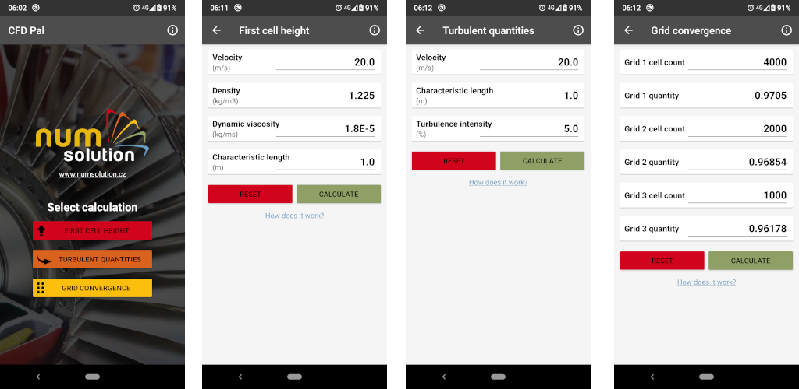

# CFD Pal 
Useful app for CFD engineers

 

## Features
* Estimate first cell height for given target y+ based on flat plane correlation.
* Calculate turbulent quantities (k, omega, nu tilda) for given inlet conditions.
* Examine spatial mesh convergence by calculating grid convergence index, observed order of convergence and estimate value of target quantity at zero grid spacing with confidence interval.

## Changelog
* 1.0:
  * Initial release

## License
CFD Pal is licensed under GNU GENERAL PUBLIC LICENSE Version 3 (see LICENSE for details).

## Used libraries
* Material Design icons by Google  
http://google.github.io/material-design-icons  
Apache License Version 2.0
* Butter Knife  
https://github.com/JakeWharton/butterknife
Apache License Version 2.0  
