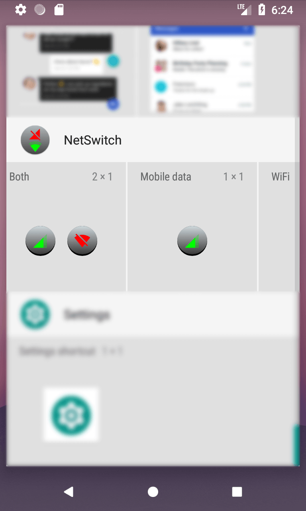
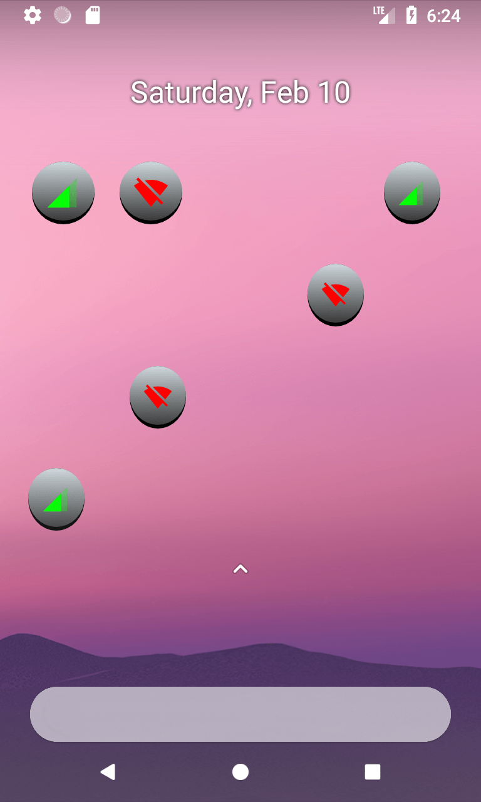

# NetSwitch 
A simple widget for WiFi/mobile data toggling on Android.

## Details
* Requires root access in order to toggle mobile data 
* Supports Android 5.1+ (API level 22+)

## Changelog
* 1.1:
  * add 1x1 widgets (idea by [sebus1201](https://github.com/sebus1201))
* 1.0:
  * initial release

## License
NetSwitch is licensed under Apache License Version 2.0 (see LICENSE for details).

## Used libraries
* Material Design icons by Google  
http://google.github.io/material-design-icons  
Apache License Version 2.0
* libsuperuser  
https://github.com/Chainfire/libsuperuser  
Apache License Version 2.0  
